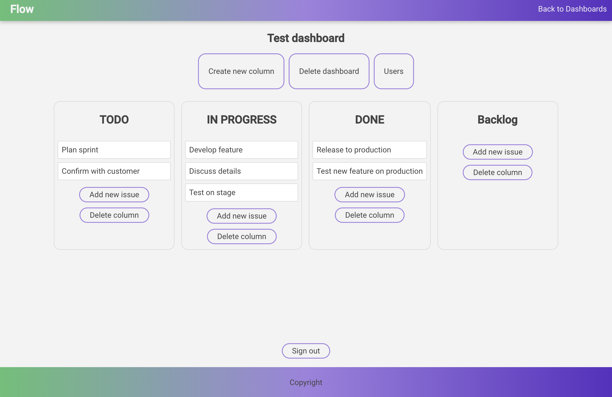

# Flow app 

Issue tracking application

- ⚛️ React 
- 🧪 GraphQl
- 🌱 MongoDb
- 💅 Grommet




Node:

- NodeJS = 10.15.0

Please configure [.env file in server folder:](/packages/server/README.md) 

Install
```
yarn install
```

Start: 
```
npm start
```
Launch server application: 
```
npm run server
```
Launch client application:
```
npm run client
```
